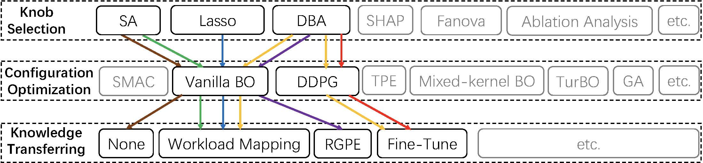

# DBTune: Customized and Efficient Database Tuning System

**DBTune** is a customized and efficient database tuning system that can automatically find good configuration knobs for a database system. It supports multiple tuning scenarios, including performance tuning, resource-oriented tuning or multiple-objective tuning defined by the users. DBTune is equipped with state-of-the-art techniques for tuning a database. DBTune is designed and developed by the database team from the <a href="https://cuibinpku.github.io/index.html" target="_blank" rel="nofollow">DAIR Lab</a> at Peking University.


## Why DBTune?
- **Optimized for database tuning:** DBTune has customized functions and user-friendly interfaces for tuning the DBMSs. Users can conduct performance tuning, resource tuning or multiple-objective tuning by simply setting their tuning objectives.

- **Comprehensive technique supports and automatic selection:** DBTune is equipped with state-of-the-art tuning techniques.
It automatically chooses the proper algorithms for a specific tuning task to separate algorithm selection complexity  away from the user.

- **Performance boosted by transfer learning:** DBTune extracts knowledge from historical tuning tasks to speed up the current tuning. The more users utilize DBTune, the faster the tuning will be. 

### Overview of Supported Techniques 
DBTune e supports the whole pipeline of configuration tuning, including knob selection, configuration tuning and knowledge transfer. 
Each module is equipped with multiple algorithm choices.
For a given tuning task, DBTune automatically selects a proper solution path among the choices.

<p align="middle">

</p>

## Installation 
Installation Requirements:
- Python >= 3.6 

### Manual Installation from Source
To install the newest DBTune package, type the following scripts on the command line:
 ```shell
   git clone git@github.com:Blairruc-pku/DBTuner.git && cd DBTune
   pip install -r requirements.txt
   pip install .
   ```


## Preparation 
####  Workload Preparation 
DBTune currently supports three database benchmarks:  <a href="https://github.com/oltpbenchmark/oltpbench.git" target="_blank" rel="nofollow">OLTP\-Bench</a>,  <a href="https://github.com/akopytov/sysbench.git" target="_blank" rel="nofollow">SYSBENCH</a>  and <a href="https://github.com/winkyao/join-order-benchmark" target="_blank" rel="nofollow">JOB</a>. 
Please reffer to the <a href="https://github.com/Blairruc-pku/DBTuner/blob/main/workload_prepare.md" target="_blank" rel="nofollow">details instuction</a>  for preparing the workloads.
####  Database Connection Setup
To provide the database connection information, the users need to edit the `config_auto.ini`.
```ini
db = mysql
host = 127.0.0.1
port = 3306
user = root
passwd =
  ```
DBTune currently supports to be deployed on MySQL and PostgreSQL using an integrated framework.
It provides several settings for database connections, including 
 <a href="https://github.com/Blairruc-pku/DBTuner/blob/main/documents/database_setting.md#remote--local-database" target="_blank" rel="nofollow"> remote/local database connection</a>,
<a href="https://github.com/Blairruc-pku/DBTuner/blob/main/documents/database_setting.md#tuning-non-dynamic-knobs" target="_blank" rel="nofollow">tuning non-dynamic knobs with restarts</a>, 
and <a href="https://github.com/Blairruc-pku/DBTuner/blob/main/documents/database_setting.md#tuning-with-resource-isolation" target="_blank" rel="nofollow">tuning with resource isolation</a>.
Please reffer to the <a href="https://github.com/Blairruc-pku/DBTuner/blob/main/documents/database_setting.md" target="_blank" rel="nofollow">details configurations</a>  for more information.

## Quick Start

 
1. Specify the tuning objective in `config_auto.ini`. Here are some examples.


    Performance tuning, e.g., maximizing throughputs.
    ```ini
    task_id = performance1
    performance_metric = ['tps']
    ```
    
    Resource-oriented tuning, e.g., minimizing  cpu resource while throughputs > 200 txn/s and 95th percentile latency < 60 sec.

    ```ini
    task_id = resource1
    performance_metric = ['-cpu']
    #constraints: Non-positive constraint values (”<=0”) imply feasibility.
    constraints = ["200 - tps", "latency - 60"]
    ```

    Multiple objective tuning, e.g., maximizing throughput and minimizing I/O.
    ```ini
    task_id = mutiple1
    performance_metric = ['tps', '-cpu]
    reference_point = [0, 100]
   ```

2. Conduct Tuning.
    ```bash
    cd scripts
    python optimize.py  --config=config_performance.ini
    ```

    For more information, please refer to the <a href="https://github.com/Blairruc-pku/DBTuner/blob/main/documents/tuning_setting.md#specific-tuning-setting" target="_blank" rel="nofollow">specific tuning settings </a>. 
    
    
## Related Publications

**Facilitating Database Tuning with Hyper-Parameter Optimization: A Comprehensive Experimental Evaluation**[[PDF](https://arxiv.org/abs/2110.12654)]<br>
Xinyi Zhang, Zhuo Chang, Yang Li, Hong Wu, Jian Tan, Feifei Li, Bin Cui.<br>
The 48th International Conference on Very Large Data Bases .<br>
***VLDB 2022, CCF-A</font></b>***

**Towards Dynamic and Safe Configuration Tuning for Cloud Databases**[[PDF](https://arxiv.org/abs/2203.14473)]<br>
Xinyi Zhang, Hong Wu, Yang Li, Jian Tan, Feifei Li, Bin Cui.<br>
ACM Conference on Management of Data .<br>
***SIGMOD 2022, CCF-A</font></b>***

**ResTune: Resource Oriented Tuning Boosted by Meta-Learning
for Cloud Databases**[[PDF](https://dl.acm.org/doi/10.1145/3448016.3457291)]<br>
Xinyi Zhang, Hong Wu, Zhuo Chang, Shuowei Jin, Jian Tan, Feifei Li,
Tieying Zhang, and Bin Cui.<br>
ACM Conference on Management of Data .<br>
***SIGMOD 2021, CCF-A</font></b>***

## Contact

If you have any technical questions, please submit new issues.

If you have any other questions, please contact Xinyi Zhang[zhang_xinyi@pku.edu.cn] and Zhuo Chang[z.chang@pku.edu.cn].
  
